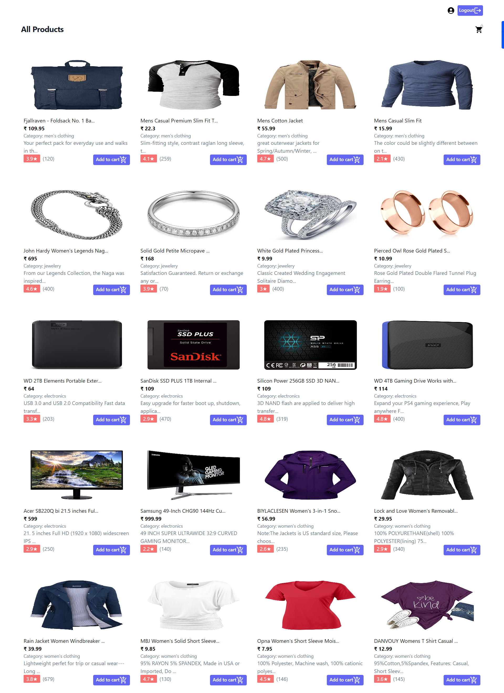
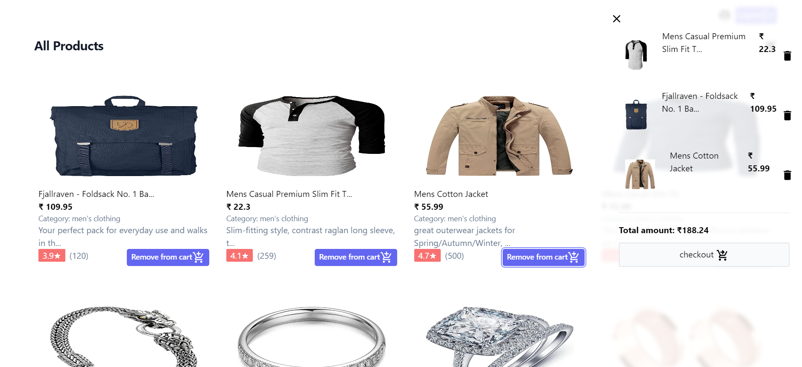
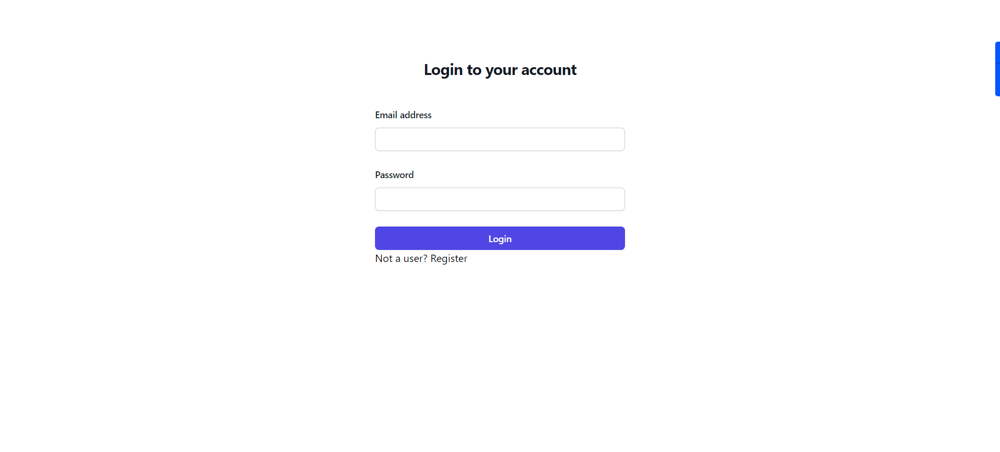
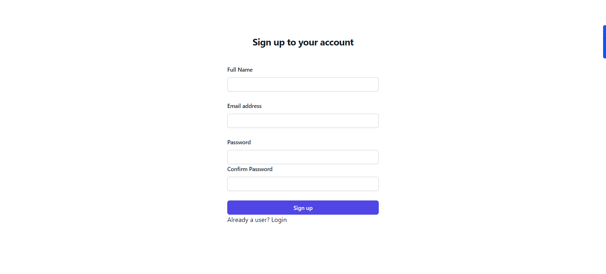
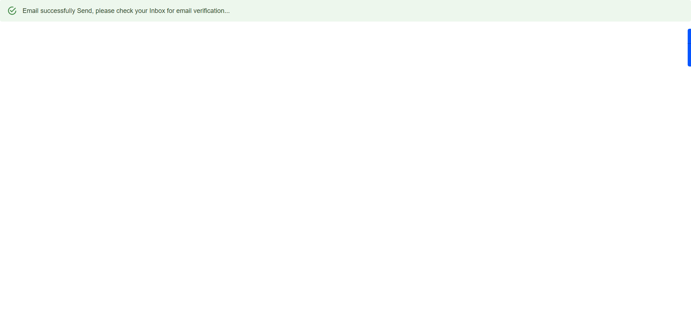
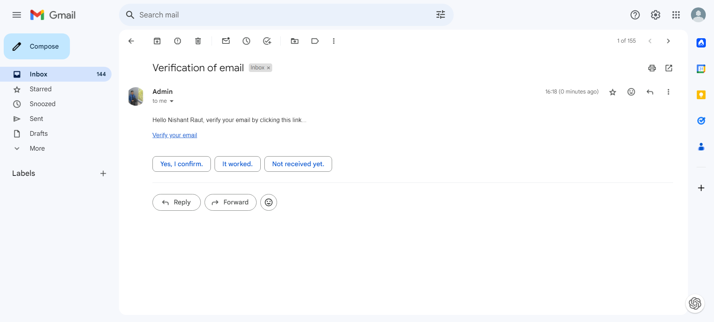
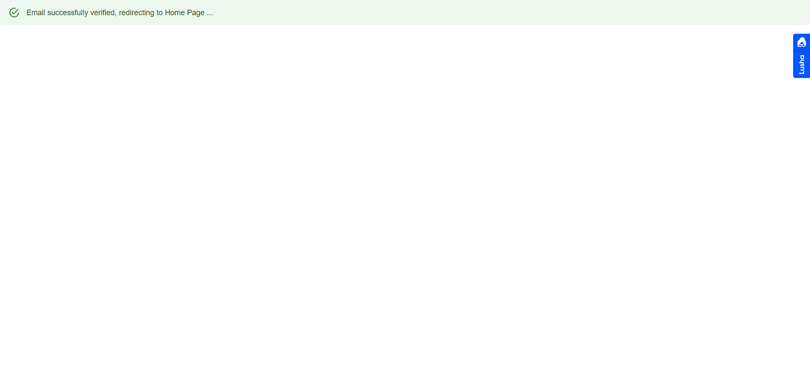

### Home Page
The home page serves as the main entry point for users. It offers a seamless navigation experience with SignUp and Login options on the top right corner for visitors who are not logged in, and for those who are logged in, it provides a profile icon and a logout button. A convenient cart icon is also present, opening the cart menu when clicked. The page showcases a comprehensive list of all available products.

### Cart
The cart menu provides a user-friendly interface, displaying a list of items in the cart along with a delete icon for easy removal of items. The total cost of all items is prominently featured to enhance transparency and user awareness.

### Login Page
The login page facilitates user access through email and password. Users are required to verify their email before logging in to ensure security.

### SignUp Page
Creating an account is made simple yet secure. Users must provide a unique and valid email address, and the password must be more than 8 characters, matching the confirm password.

Upon successful verification, an "Email sent" alert pops up.

### Verification Email
To enhance account security, users receive a verification email that must be confirmed to proceed with the login process.

### Verification Page
Upon clicking the verification email, a brief confirmation page appears for 2 seconds before redirecting users to the home page.

### Tech Stack:
The application leverages a robust tech stack to ensure a smooth user experience:
- **React.js:** Used for creating an intuitive user interface.
- **Node.js & Express.js:** Power the backend and API, facilitating user authentication.
- **MongoDB:** The database of choice for storing user information securely.
- **NodeMailer:** Enables the seamless sending of verification emails for enhanced account security.
